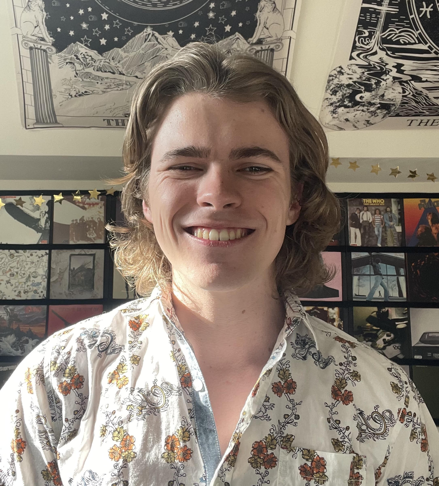

# Brennan Meighan

  

  

    My name is Brennan Meighan. Currently, I am a third year student attending the University of Washington Paul G. Allen School of Computer Science. I consider myself to be a very passionate and dedicated person, and computer science is a great way to focus my energy and efforts into creating something interesting. I want to use what I've learned to help people and put good into the world, and that's what I plan on doing once I graduate.
  

------  

### University of Washington
> Major: Computer Science  
> Minor: Music
+ CSE 311 & 312
    + Foundations of Computing I & II
+ CSE 331
    + Software Design & Implementation
+ CSE 332
    + Data Structures & Parallelism
+ CSE 333
    + Systems Programming
+ CSE 344
    + Introduction to Data Management
+ CSE 351
    + The Hardware/Software Interface
+ CSE 461
    + Introduction to Computer-Communication Networks

------

  

    <h3>Languages Profficient</h3>
    <ul>
      <li>Java</li>
      <li>Javascript</li>
      <li>Python</li>
      <li>HTML</li>
      <li>C</li>
      <li>C++</li>
    </ul>
  

  

    <h3>Personal Skills</h3>
    <ul>
      <li>Bass Guitar</li>
      <li>Piano</li>
      <li>Cooking</li>
      <li>Leadership</li>
      <li>Organization</li>
      <li>Collabarition</li>
    </ul>
  

------

### Work Experience
> #### Barista
> Starbucks - Seattle, WA  
> June - Sept 2023, Aug - Sept 2024  
> I fulfilled all the duties and expectations of a Starbucks partner: making drinks, heating food, taking orders, keeping everything stocked, cleaning, etc.

> #### Sandwich Maker
> Tubs Gourmet Subs - Seattle, WA  
> Jan - June 2022  
> Every shift, I would do whatever needed to be done in the kitchen; making, topping, and sending sandwiches, prepping ingredients and sides, taking orders, maintaining a clean workspace, etc.

> #### Dishwasher
> Cafe Lago - Seattle, WA  
> June - Aug 2021  
> I washed the dishes of the kitchen and floor and helped with food prep such as making lasagna filling and tomato sauce

------