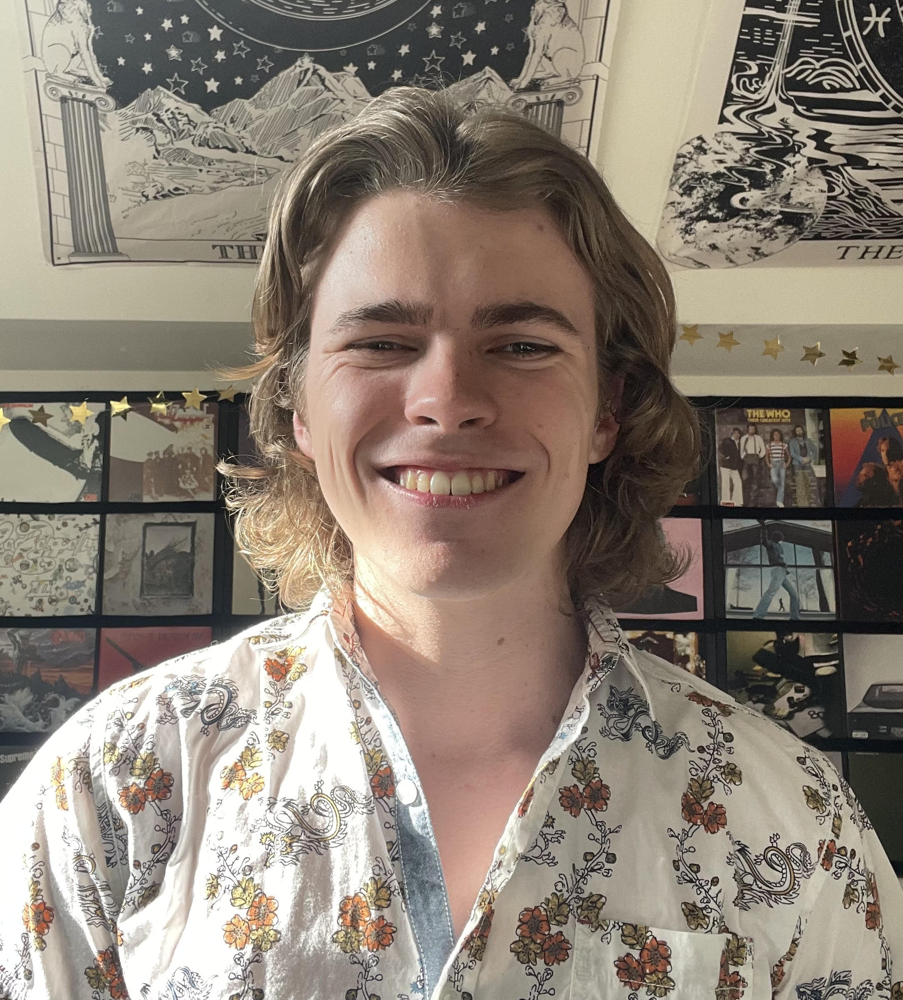
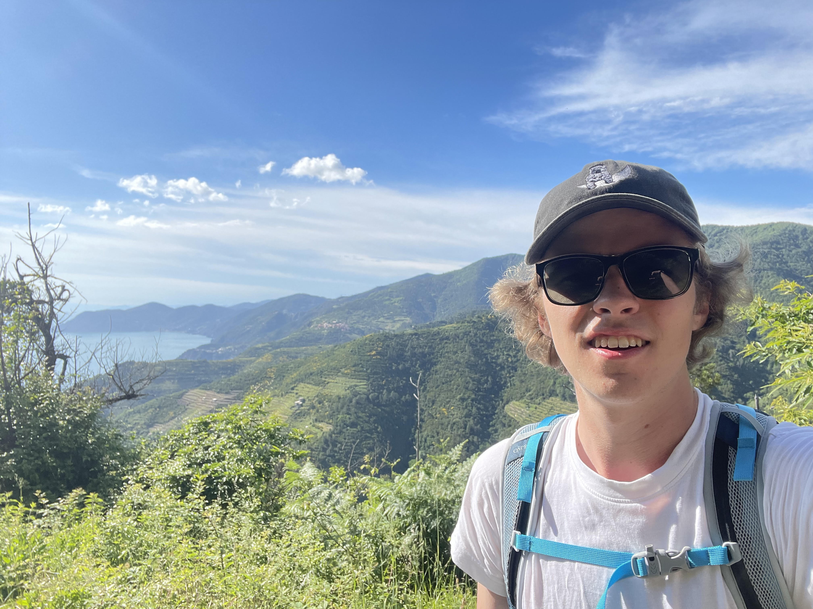
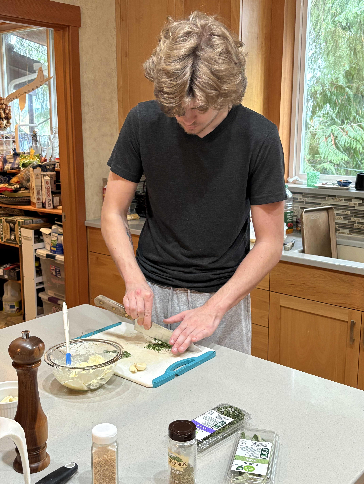

# Brennan Meighan

  

  

    My name is Brennan Meighan. I recently graduated the University of Washington Paul G. Allen School of Computer Science with a major in computer science and a minor in music. While the last four years of my life have been spent working towards this achievement, I'm ready to move on and pursue the things I'm truly passionate about. One of those things is food and drinks. I love cooking more than anything in the world, and I've spent years pushing myself to be the best cook I can be. Additionally, I've always been very interested in the world of drinksmanship, and my employment at Matthews Winery & From the Sky Down has made me all the more excited and eager. As for myself, I have leadership skills, I'm incredibly hard-working, I pick things up very fast, I work very well with others, I'm organized, I can handle any situation thrown at me, and I can always do what needs to be done when it needs to be done. I'm young, I'm hungry, and I'm ready to put my skills to good use.
  

------  

### University of Washington
> **Major:** Computer Science  
> **Minor:** Music
+ **CSE 311 & 312**
    + Foundations of Computing I & II
+ **CSE 331**
    + Software Design & Implementation
+ **CSE 332**
    + Data Structures & Parallelism
+ **CSE 333**
    + Systems Programming
+ **CSE 344**
    + Introduction to Data Management
+ **CSE 351**
    + The Hardware/Software Interface
+ **CSE 434**
    + Introduction to Quantum Computation
+ **CSE 446**
    + Machine Learning
+ **CSE 461**
    + Introduction to Computer-Communication Networks
+ **CSE 473**
    + Artificial Intelligence
+ **CSE 484**
    + Computer Security
+ **ANTH 462**
    + Italian Food Culture
+ **MUSIC 116**
    + Elementary Music Theory
+ **MUSIC 120**
    + Introduction to Classical Music
+ **MUSAP 133**
    + Basic Keyboard
+ **MUSIC 325**
    + Music in Cinema
+ **DXARTS 460-462**
    + Digital Sound, Digital Sound Synthesis, Digital Sound Processing

------

  

    <h3>Languages Profficient</h3>
    <ul>
      <li>Java</li>
      <li>Javascript</li>
      <li>Python</li>
      <li>HTML</li>
      <li>C</li>
      <li>C++</li>
    </ul>
  

  

  

  

    <h3>Personal Skills</h3>
    <ul>
      <li>Bass Guitar</li>
      <li>Piano</li>
      <li>Cooking</li>
      <li>Mixology</li>
      <li>Leadership</li>
      <li>Organization</li>
      <li>Collaboration</li>
    </ul>
  

------

### Work Experience
> #### Busser / Greeter
> Matthews Winery & From the Sky Down - Woodinville, WA  
> June 2026 - Present  
> I greet and welcome guests when they come in the door with conversation and a splash of wine, I seat said guests and organize who gets sat where and why, I take care of all the glasses used throughout the day, I help out the servers with whatever they need, I maintain a clean and efficient work environment, and I learn as much as I can from my coworkers every day.

> #### Busser / Host
> Piatti - Seattle, WA  
> Autumn 2025 
> I was almost always the sole busser and host for the entire 200-capacity restaurant each shift. Duties included bussing, cleaning, and resetting tables, seating and watering guests, assembling and running all bread orders, and generally assisting the wait and kitchen staff.

> #### Barista
> Starbucks - Seattle, WA  
> Summer 2023, 2024  
> I fulfilled all the duties and expectations of a Starbucks partner: making drinks, heating food, taking orders, keeping everything stocked, cleaning, etc.

> #### Sandwich Maker
> Tubs Gourmet Subs - Seattle, WA  
> Jan - June 2022  
> Every shift, I would do whatever needed to be done in the kitchen; making, topping, and sending sandwiches, prepping ingredients and sides, taking orders, maintaining a clean workspace, etc.

> #### Dishwasher
> Cafe Lago - Seattle, WA  
> Summer 2021  
> I washed the dishes of the kitchen and floor and helped with food prep such as making lasagna filling and tomato sauce

------
